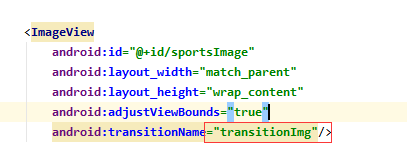
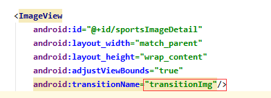

# 练习

## 左滑和右滑删除卡片

```java
 public void onSwiped(RecyclerView.ViewHolder viewHolder, int direction) {
     // Remove the item from the dataset.
     mSportsData.remove(viewHolder.getAdapterPosition());
     // Notify the adapter.
     mAdapter.notifyItemRemoved(viewHolder.getAdapterPosition());
 }
```


## 移动卡片位置

```java
 public boolean onMove(RecyclerView recyclerView, RecyclerView.ViewHolder viewHolder, RecyclerView.ViewHolder target) {
     // Get the from and to positions.
     int from = viewHolder.getAdapterPosition();
     int to = target.getAdapterPosition();

     // Swap the items and notify the adapter.
     Collections.swap(mSportsData, from, to);
     mAdapter.notifyItemMoved(from, to);
     return true;
 }
```


## 点击卡片跳转详情页

mSportsImage为共享元素

```java
public void onClick(View view) {
    Sport currentSport = mSportsData.get(getAdapterPosition());
    Intent detailIntent = new Intent(mContext, DetailActivity.class);
    detailIntent.putExtra("title", currentSport.getTitle());
    detailIntent.putExtra("image_resource",
                          currentSport.getImageResource());
    ActivityOptions options = null;
    if (android.os.Build.VERSION.SDK_INT >= android.os.Build.VERSION_CODES.LOLLIPOP) {
        options = ActivityOptions.makeSceneTransitionAnimation((Activity) mContext, mSportsImage, "transitionImage");
        mContext.startActivity(detailIntent, options.toBundle());
    } else {
        mContext.startActivity(detailIntent);
    }
}
```


## reset

原理就是删除已经存在的数据后对数据重新初始化

```java
public void resetSports(View view) {
    initializeData();
}

private void initializeData() {
    // Get the resources from the XML file.
    String[] sportsList = getResources()
        .getStringArray(R.array.sports_titles);
    String[] sportsInfo = getResources()
        .getStringArray(R.array.sports_info);
    TypedArray sportsImageResources = getResources()
        .obtainTypedArray(R.array.sports_images);

    // Clear the existing data (to avoid duplication).
    mSportsData.clear();

    // Create the ArrayList of Sports objects with the titles and
    // information about each sport
    for (int i = 0; i < sportsList.length; i++) {
        mSportsData.add(new Sport(sportsList[i], sportsInfo[i],
                                  sportsImageResources.getResourceId(i, 0)));
    }

    // Recycle the typed array.
    sportsImageResources.recycle();

    // Notify the adapter of the change.
    mAdapter.notifyDataSetChanged();
}
```


# 作业

## 指定共享元素过滤

### list_item.xml



### activity_detail.xml



## 使用ActivityOptions.makeSceneTransitionAnimation()函数

```java
public void onClick(View view) {
    Sport currentSport = mSportsData.get(getAdapterPosition());
    Intent detailIntent = new Intent(mContext, DetailActivity.class);
    detailIntent.putExtra("title", currentSport.getTitle());
    detailIntent.putExtra("image_resource",
                          currentSport.getImageResource());
    ActivityOptions options = null;
    if (android.os.Build.VERSION.SDK_INT >= android.os.Build.VERSION_CODES.LOLLIPOP) {
        options = ActivityOptions.makeSceneTransitionAnimation((Activity) mContext, mSportsImage, "transitionImage");
        mContext.startActivity(detailIntent, options.toBundle());
    } else {
        mContext.startActivity(detailIntent);
    }
}
```

## 在DetailActivity.java创建菜单栏返回按钮，调用Activity.finishAfterTransition()函数

```java
public boolean onOptionsItemSelected(MenuItem item) {
    switch (item.getItemId()) {
        case android.R.id.home:
            if (Build.VERSION.SDK_INT >= Build.VERSION_CODES.LOLLIPOP) {
                this.finishAfterTransition();
            } else {
                this.finish();
            }
            return true;
    }
    return super.onOptionsItemSelected(item);
}
```


